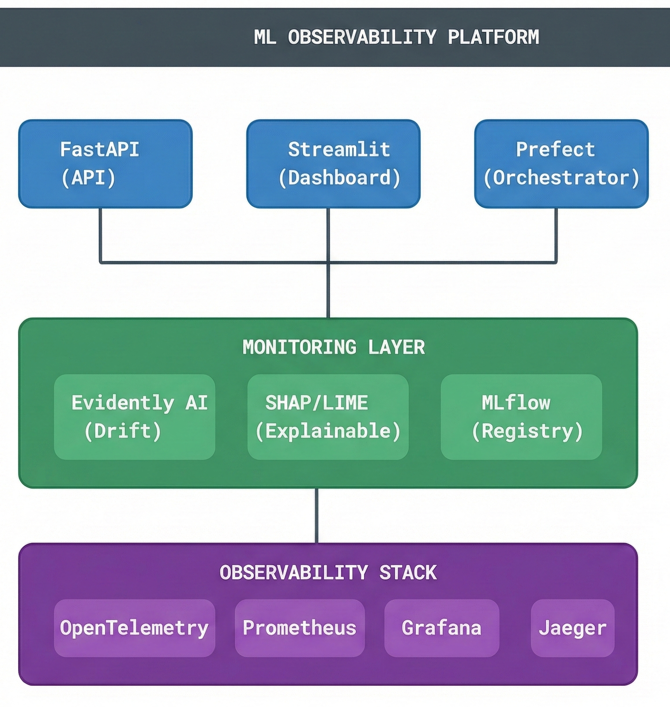

# ML Observability Platform

A production-grade ML observability platform demonstrating real-time model monitoring, drift detection, and alerting capabilities.


## 🎯 Overview

This platform provides comprehensive monitoring for machine learning models in production, featuring:

- **Three ML Models**: Fraud Detection (XGBoost), Price Prediction (LightGBM), Churn Prediction (Random Forest)
- **Data Drift Detection**: PSI-based drift monitoring using statistical tests
- **Real-time Alerting**: Configurable alerts with severity levels and lifecycle management
- **Prometheus Metrics**: Full observability with custom ML metrics
- **Grafana Dashboards**: Pre-configured dashboards for visualization
- **REST API**: FastAPI-based service with OpenAPI documentation

## 🏗️ Architecture

<p align="center">
  
</p>

## 🚀 Quick Start

### Prerequisites

- Python 3.10+
- Docker & Docker Compose (for full stack)
- uv (recommended) or pip

### Installation
```bash
# Clone the repository
git clone https://github.com/yourusername/ml-observability-platform.git
cd ml-observability-platform

# Install dependencies
make dev

# Generate synthetic data
make generate-data

# Train models
make train-models

# Setup reference data for drift detection
make setup-reference
```

### Running the API
```bash
# Development mode (with hot reload)
make run-api-dev

# Production mode
make run-api
```

API will be available at http://localhost:8000

- **Swagger UI**: http://localhost:8000/docs
- **ReDoc**: http://localhost:8000/redoc

### Running with Docker
```bash
# Build and start all services
make docker-up

# View logs
make docker-logs

# Stop services
make docker-down
```

Services:
- **API**: http://localhost:8000
- **Prometheus**: http://localhost:9090
- **Grafana**: http://localhost:3000 (admin/admin)

## 📁 Project Structure
```
ml-observability-platform/
├── src/
│   ├── api/                    # FastAPI application
│   │   ├── app.py              # Main application
│   │   ├── schemas.py          # Pydantic models
│   │   └── routes/             # API endpoints
│   │       ├── health.py       # Health checks
│   │       ├── predictions.py  # Prediction endpoints
│   │       └── monitoring.py   # Monitoring endpoints
│   ├── data/                   # Data generation
│   │   └── generator.py        # Synthetic data generator
│   ├── models/                 # ML models
│   │   ├── base.py             # Base model class
│   │   ├── fraud_detector.py   # Fraud detection model
│   │   ├── price_predictor.py  # Price prediction model
│   │   ├── churn_predictor.py  # Churn prediction model
│   │   └── preprocessing.py    # Feature preprocessing
│   └── monitoring/             # Monitoring components
│       ├── drift_detector.py   # Drift detection
│       ├── metrics.py          # Prometheus metrics
│       └── alerts.py           # Alert management
├── scripts/
│   ├── generate_data.py        # Data generation script
│   ├── train_models.py         # Model training script
│   ├── demo.py                 # Interactive demo
│   └── simulate_traffic.py     # Traffic simulation
├── tests/
│   ├── unit/                   # Unit tests
│   └── integration/            # Integration tests
├── prometheus/                 # Prometheus configuration
├── grafana/                    # Grafana dashboards
├── Dockerfile                  # Container build
├── docker-compose.yml          # Full stack deployment
├── Makefile                    # Common commands
└── pyproject.toml              # Project configuration
```

## 🔌 API Endpoints

### Health

| Endpoint | Method | Description |
|----------|--------|-------------|
| `/health` | GET | Health check with model status |
| `/health/live` | GET | Kubernetes liveness probe |
| `/health/ready` | GET | Kubernetes readiness probe |

### Predictions

| Endpoint | Method | Description |
|----------|--------|-------------|
| `/predict/fraud` | POST | Fraud detection prediction |
| `/predict/price` | POST | Property price prediction |
| `/predict/churn` | POST | Customer churn prediction |
| `/predict/batch` | POST | Batch predictions |
| `/predict/models` | GET | List available models |

### Monitoring

| Endpoint | Method | Description |
|----------|--------|-------------|
| `/monitoring/drift/check` | POST | Check data drift |
| `/monitoring/drift/status/{model}` | GET | Get drift detector status |
| `/monitoring/quality/check` | POST | Check data quality |
| `/monitoring/alerts` | GET | List alerts |
| `/monitoring/alerts/summary` | GET | Alert summary |
| `/monitoring/alerts/{id}` | GET | Get alert details |
| `/monitoring/alerts/{id}/acknowledge` | POST | Acknowledge alert |
| `/monitoring/alerts/{id}/resolve` | POST | Resolve alert |
| `/monitoring/metrics` | GET | Prometheus metrics |

## 📊 Monitoring Features

### Drift Detection

The platform monitors for several types of drift:

- **Data Drift**: Distribution changes in input features
- **Concept Drift**: Changes in the relationship between features and target
- **Prediction Drift**: Changes in model output distribution

Drift is detected using:
- **PSI (Population Stability Index)** for numerical features
- **Jensen-Shannon Divergence** for categorical features

### Metrics Collected
```
# Prediction metrics
mlobs_predictions_total{model_name, status}
mlobs_prediction_latency_seconds{model_name}
mlobs_prediction_value{model_name}

# Drift metrics
mlobs_drift_score{model_name, feature}
mlobs_dataset_drift_detected{model_name, dataset_name}
mlobs_drift_share{model_name}
mlobs_drifted_features_count{model_name}

# Data quality metrics
mlobs_missing_values_share{model_name, dataset_name}
mlobs_duplicate_rows_count{model_name, dataset_name}

# Alert metrics
mlobs_alerts_total{model_name, alert_type, severity}
mlobs_active_alerts{model_name}
```

### Alert Types

| Alert Type | Description | Default Threshold |
|------------|-------------|-------------------|
| `drift_detected` | Data drift detected | drift_share > 0.2 |
| `drift_critical` | Critical drift level | drift_share > 0.3 |
| `performance_degradation` | Model performance drop | accuracy < 0.8 |
| `data_quality_issue` | Data quality problems | missing > 10% |
| `high_latency` | Slow predictions | p99 > 500ms |

## 🧪 Testing
```bash
# Run all tests
make test

# Run unit tests only
make test-unit

# Run integration tests
make test-integration

# Run with coverage
pytest tests/ -v --cov=src --cov-report=html
```

## 🎮 Demo

Run the interactive demo to see all features:
```bash
python scripts/demo.py
```

Simulate traffic for monitoring demonstration:
```bash
# Start the API first
make run-api-dev

# In another terminal, run traffic simulation
python scripts/simulate_traffic.py --duration 120 --rate 5 --drift 0.3
```

## 🔧 Configuration

### Environment Variables

| Variable | Description | Default |
|----------|-------------|---------|
| `LOG_LEVEL` | Logging level | `INFO` |
| `MODEL_DIR` | Model storage directory | `models/` |
| `DATA_DIR` | Data storage directory | `data/` |

### Drift Detector Configuration
```python
DriftDetector(
    psi_threshold_warning=0.1,    # Warning threshold
    psi_threshold_critical=0.2,   # Critical threshold
    drift_share_threshold=0.3,    # % features to trigger alert
)
```

## 📈 Grafana Dashboards

The platform includes pre-configured Grafana dashboards:

1. **ML Observability Platform** - Main dashboard
   - Model status indicators
   - Prediction throughput
   - Latency percentiles
   - Drift status
   - Data quality metrics
   - Active alerts

## 🤝 Contributing

1. Fork the repository
2. Create a feature branch (`git checkout -b feature/amazing-feature`)
3. Run tests (`make test`)
4. Run linters (`make lint`)
5. Commit changes (`git commit -m 'Add amazing feature'`)
6. Push to branch (`git push origin feature/amazing-feature`)
7. Open a Pull Request

## 📝 License

This project is licensed under the MIT License - see the [LICENSE](LICENSE) file for details.

## 🙏 Acknowledgments

- [FastAPI](https://fastapi.tiangolo.com/) - Modern web framework
- [Evidently AI](https://evidentlyai.com/) - ML monitoring inspiration
- [Prometheus](https://prometheus.io/) - Metrics collection
- [Grafana](https://grafana.com/) - Visualization
- [XGBoost](https://xgboost.readthedocs.io/) - Gradient boosting
- [LightGBM](https://lightgbm.readthedocs.io/) - Fast gradient boosting
- [scikit-learn](https://scikit-learn.org/) - ML utilities
